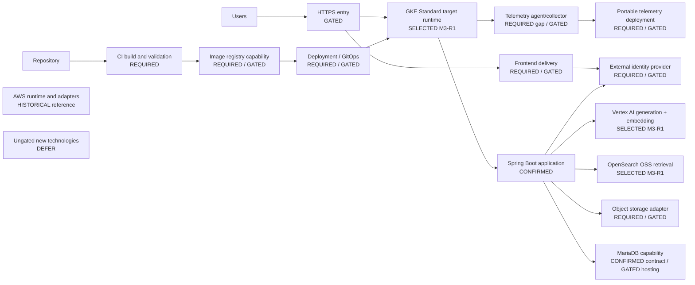

# GCP Deployment Architecture

## Purpose

This planning document maps the provider-neutral [target architecture](target-architecture.md) to capabilities that can be deployed on the current target, GCP. GCP migration is not itself the project goal: the goals remain backend reliability, evaluated AI/RAG improvement, failure-diagnosis observability, and cloud portability. The logical/application architecture stays cloud-provider-neutral, while provider-specific details are confined to adapter and deployment layers.

This is not a Terraform implementation, resource-creation guide, final capacity or cost plan, or production runbook. It creates no GCP resources and selects no unverified product or topology. Product and topology choices lacking quota, capacity, cost, runtime, and operational evidence remain **GATED** or `UNKNOWN/TBD`.

## Deployment principles

- GCP is the current deployment target; choosing a GCP resource does not change the logical architecture.
- Existing Spring Boot, domain/business flows, `AnalysisJob` lifecycle, and provider-neutral ports are retained.
- The existing container and Kubernetes-compatible base/workload contract is reused. This requires a compatible runtime, but does not select GKE or another compute topology.
- MariaDB with Flyway remains the relational contract. Hosting is a separate gated choice.
- Provider-specific identity, object storage, retrieval transport, model access, credentials, and telemetry belong behind application ports or in the deployment layer.
- Historical AWS runtime, infrastructure, and delivery assets are compatibility/baseline references, not the active deployment target and not a template for one-to-one product substitution.
- Release and operations require immutable image/release identity, least privilege, reproducible configuration, deterministic validation, and deployment, rollback, teardown, and closure evidence.
- These requirements are capabilities and principles, not selections of particular GCP products.

## Single target runtime lifecycle

GCP/open-source live infrastructure is built once and reused across milestones. There is no
evaluation-only cloud environment followed by a separately implemented final environment.

- M3-R1 decides target capabilities from actual quota/cost/contract evidence.
- M3-R2/R3 create the reusable target AI/RAG foundation and corpus/index path.
- M3-4 measures that same runtime.
- M4 changes and re-evaluates that same runtime.
- M7/M8 add diagnosis/failure evidence against the same runtime where applicable.
- M9 completes delivery, rollback, teardown and cost/resource closure for that runtime rather than
  rebuilding it.

Different parameter sets may be introduced later only when justified, and they must reuse the same
IaC/application artifacts. Local/CI/Kind environments are deterministic verification paths, not
additional live cloud deployments.

## Status vocabulary

| Status | Meaning |
| --- | --- |
| **CONFIRMED** | A deployment requirement already fixed by repository source of truth. |
| **SELECTED** | A provider/product/topology choice accepted by ADR evidence but not necessarily implemented yet. |
| **REQUIRED** | A logical deployment capability needed to run the target architecture; it may not be implemented and a concrete product may not be selected. |
| **GATED** | A choice requiring measured quota, capacity, cost, runtime, or operational evidence and, where applicable, a separate decision. |
| **HISTORICAL** | An AWS-era implementation retained only as compatibility, baseline, or reference material. |
| **DEFER** | A technology choice withheld because no observed problem and decision-gate evidence justify it. |

**REQUIRED never means currently implemented.** `UNKNOWN/TBD` identifies evidence values absent from the repository; it is not a selected default.

## Capability map

| Logical responsibility | Required deployment capability | Current repository state | GCP decision status | Evidence required before selection |
| --- | --- | --- | --- | --- |
| Frontend delivery | Browser-accessible frontend and configuration/auth integration | Frontend flow exists; Amplify-era delivery is provider-specific | **REQUIRED** capability; delivery product/topology **GATED** | Build artifact shape, routing, cache/config behavior, identity integration, HTTPS and operational burden |
| Spring Boot runtime | Container workload runtime compatible with the existing Kubernetes contract | Spring Boot backend, container image, Kubernetes base/workload are **CONFIRMED** reusable assets | **SELECTED M3-R1:** one zonal GKE Standard target cluster; exact mutable sizing still pre-apply gated | Fresh CPU/instance/disk quota, zonal capacity, current cost and resource headroom |
| Container/image registry | Immutable, addressable images available to the runtime | Reproducible image and immutable release principles exist; ECR is **HISTORICAL** | **REQUIRED**, implementation **GATED** | Registry access, retention, regional availability, CI/runtime identity, cost/quota |
| Relational database | Persistent MariaDB compatible with Flyway | MariaDB + Flyway **CONFIRMED** for reuse; AWS RDS deployment **HISTORICAL** | Hosting model **GATED** | MariaDB compatibility, quota/cost, backup/restore, private connectivity, persistence and operational burden |
| Object storage | Read/write object capability behind `ObjectReader`/`ObjectWriter` | Ports and business flow **CONFIRMED**; S3 adapter **HISTORICAL** | Capability **REQUIRED**; adapter/product **GATED** for M1 | Contract compatibility, identity/access, metadata, size, lifecycle, locality, cost/quota and migration evidence |
| OpenSearch-compatible retrieval | Endpoint/runtime, persistent index, runtime queries, batch ingestion and credential boundary | `ReferenceRetriever` and OpenSearch query contract retained; AOSS/SigV4 **HISTORICAL** | **SELECTED M3-R1:** OpenSearch OSS single-node StatefulSet in the target GKE cluster | Image compatibility, persistent-disk sizing, private transport/auth and target ingestion/query smoke |
| Model/embedding access | Generation and embedding adapters with runtime credentials and measurable behavior | `AnalysisProvider` and `EmbeddingProvider` **CONFIRMED** ports; Bedrock adapters **HISTORICAL** | **SELECTED M3-R1:** Vertex AI `gemini-3.8-flash` + `gemini-embedding-001` (1024-d) | Fresh model access/quota, adapter contract, latency/error/cost evidence |
| External identity | Browser authentication, token issuance, Resource Server validation, external-subject mapping | Boundary and internal-user semantics retained; Cognito/Amplify **HISTORICAL** | Capability **REQUIRED**; IdP and migration **GATED** | Issuer/audience/claims, browser flow, subject migration, lifecycle, availability and operating model |
| Secrets/runtime configuration | Externalized configuration, secrets lifecycle and least-privilege runtime identity | Configuration boundaries exist but contain provider-specific values | **SELECTED for Google API identity:** Workload Identity Federation for GKE; broader secret product remains **GATED** | Least-privilege IAM and workload identity smoke; later secret lifecycle needs separate evidence |
| Observability | Metrics, logs and traces that support end-to-end root-cause analysis | Micrometer, Actuator/Prometheus-compatible metrics and correlation semantics reusable; portable traces are a gap | Signals **REQUIRED**; trace/export and hosting topology **GATED** | Failure scenario, signal volume/retention, CPU/RAM/storage budget, propagation/export validation and operator needs |
| Network/HTTPS ingress | Client HTTPS entry, frontend/backend routes, dependency egress and protected internal paths | Logical access paths exist; AWS network/load-balancing assets **HISTORICAL** | **REQUIRED**; exact network/ingress topology **GATED** | Region/project constraints, IP and load-balancer availability, TLS/DNS, private connectivity, egress and threat boundaries |
| CI/CD or GitOps delivery | Build/test, registry publish, deployment identity, manifest/config delivery, approval, smoke, rollback and evidence | Deterministic validation and GitOps-compatible manifests reusable; AWS workflows **HISTORICAL** | Capabilities **REQUIRED**; GCP integrations **GATED** | Trust boundary, identity federation, approvals, artifact provenance, rollback and runtime access |
| State/IaC management | Reproducible Terraform plan/apply with separated state and explicit outputs | Terraform patterns reusable; AWS stacks **HISTORICAL** | Approach **CONFIRMED** for reuse; GCP resource tree/backend **GATED** | Environment ownership, state access/locking, privileges, resource decisions, destroy impact and closure process |

## Candidate deployment shape

This is a capability-level candidate shape, not a selected final topology. Product names are deliberately omitted.

Legend: **CONFIRMED** is fixed repository evidence; **SELECTED** is an accepted deployment decision awaiting implementation; **REQUIRED** is a capability; **GATED** awaits more evidence/decision; **HISTORICAL** is AWS-era reference; **DEFER** is not an architecture component.

## Runtime and compute

**M3-R1 decision:** use one **zonal GKE Standard** cluster in `asia-northeast3` as the reusable
target runtime foundation. `asia-northeast3-a` is preferred for the initial apply, subject to a
fresh capacity check. The planning start value is one `e2-standard-4` node; node count and exact
disk sizing remain Terraform variables and are not HA/SLA claims.

GKE Standard is selected instead of Autopilot because the retained OpenSearch deployment requires
host `vm.max_map_count=262144`, while Standard supports node-level sysctl configuration and
Autopilot restricts unsafe/node-level sysctls. The cluster is reused by M3-4, M4 and later runtime
work rather than replaced.

M3-R2 must refresh project billing, CPU/instance/disk quota, GKE availability and current pricing
before creating resources. A quota mismatch reopens the deployment shape; it does not authorize a
second environment.

## Database

MariaDB + Flyway is a **CONFIRMED** reusable logical architecture contract. The hosting model is **GATED**. Decision categories may include a compatible managed relational database or a self-managed MariaDB workload; neither category nor a specific product is selected.

Selection requires MariaDB compatibility, resource/cost/quota, backup and restore requirements, network/private-connectivity requirements, operational burden, and persistence requirements. This plan does not substitute PostgreSQL or another database.

## Object storage

The application depends on the **CONFIRMED** `ObjectReader`/`ObjectWriter` boundary and requires a compatible object-storage capability. A GCP-native adapter is a plausible candidate, not a decision. The final adapter/product decision belongs with contract and adapter work in M1 Cloud Decoupling. The S3 adapter is **HISTORICAL** reference.

## Retrieval

**M3-R1 decision:** run **OpenSearch OSS as a single-node StatefulSet** in the same GKE Standard
cluster for the initial target runtime. It uses persistent disk and an internal Kubernetes Service;
OpenSearch is not exposed as a public endpoint.

This choice preserves `ReferenceRetriever`, `OpenSearchReferenceRetriever`, the k-NN query
builder, response parser and provenance metadata while replacing only provider-specific
transport/auth and deployment pieces. Exact OpenSearch image version and disk class/size are pinned
in M3-R2 after compatibility/quota checks.

AWS AOSS/SigV4 remains **HISTORICAL**. Vertex AI Vector Search and third-party managed search remain
**DEFER** because no measured failure requires replacing the existing OpenSearch contract.

## Identity

The deployment requires browser authentication, token issuance, Spring Resource Server-compatible validation, and external subject to internal user mapping. The exact provider, managed versus self-hosted operation, migration approach, and issuer/audience details are **GATED**. Cognito and Amplify are **HISTORICAL** provider-specific references; Keycloak is **DEFER**, not selected.

## Model and embedding access

**M3-R1 decision:** use Vertex AI `gemini-3.8-flash` for multimodal generation and
`gemini-embedding-001` for embeddings. Generation uses the model's `global` endpoint and
structured output. Query embeddings use `RETRIEVAL_QUERY`; corpus embeddings use
`RETRIEVAL_DOCUMENT`; output dimensionality is fixed at **1024** to retain the current vector
field shape.

GKE workloads authenticate to Google APIs with **Workload Identity Federation for GKE**, not
service-account key files.

Because `terraformers-reference-v2` names the historical Titan embedding model, M3-R3 creates a
new immutable `terraformers-reference-v3` embedding/index identity rather than mutating v2. Stable
document IDs and AWS Terraform provider 5.100.0 content remain reusable.

## Observability

Metrics, logs, and traces are **REQUIRED** signals. Micrometer, Actuator/Prometheus-compatible metrics, and correlation semantics are reusable. Trace propagation/export/validation and a portable telemetry deployment are current gaps.

Exact Prometheus, Loki, Tempo, or Grafana hosting, a cloud-native monitoring product, and node/VM counts are not selected. An open-source stack may be a candidate, but topology remains **GATED** by workload resource budget and M7 evidence. Completion means metric/log/trace-based root-cause analysis of a real failure, not dashboard installation.

## Network and ingress

The logical access path is `Internet/client → HTTPS entry → frontend/backend access path`. Backend egress may be required for identity metadata/JWK or provider endpoints, object storage, retrieval, model/embedding access, and package/image/runtime dependencies where applicable. Database, retrieval, and internal telemetry are not required to be publicly exposed where private access is feasible.

Exact VPC topology, subnet CIDRs, NAT, firewall rules, load-balancer product, and public/private IP allocation are **GATED**. No CIDR or IP allocation is invented here.

## Secrets and runtime identity

Long-lived static cloud credentials must not be embedded in application images or the repository. The deployment requires runtime identity, least privilege, and secret/configuration lifecycle separation from application code.

An exact secrets product, workload identity mechanism, and Kubernetes secret-integration product are **GATED**. This requirement does not select Secret Manager, Workload Identity, or any equivalent product.

## CI/CD and GitOps

Delivery reuses immutable commit/image identity, build and test before deployment, reproducible images, deployment approval gates, GitOps-compatible state, smoke validation, rollback, and evidence collection. GCP deployment requires an image registry, CI identity, deployment identity, and Kubernetes manifest/configuration delivery capabilities.

AWS ECR, OIDC federation, and deploy/teardown workflows are **HISTORICAL** implementations. Artifact Registry and Workload Identity Federation could be candidates, but are **not selected** or **CONFIRMED**. Any choice requires identity/trust, quota, availability, lifecycle, and operational evidence.

## Infrastructure as code

Terraform is an existing repository asset and the IaC approach is reused; OpenTofu is not substituted. The AWS Terraform stacks will not be ported line by line. Future GCP IaC is a new provider-specific deployment implementation behind the unchanged logical architecture.

The first live target IaC introduced before M3-4 becomes the canonical deployment implementation
for later milestones. Evaluation does not get a parallel IaC tree. If multiple parameterized
environments are ever justified, they reuse the same modules, application image, and runtime
contracts.

Required principles are environment/state separation, minimal privilege, reproducible plan/apply, explicit outputs, destructive-operation awareness, and teardown evidence. The exact resource tree, state backend, and resources are **GATED** and absent from this document.

## Capacity and quota gate

Before a GCP product or topology is selected, a capacity-discovery task must record evidence from the actual Cloud project. This is now the immediate **M3-R1** dependency task. The repository currently supplies no actual values, so every value below is `UNKNOWN/TBD`; no value should be guessed. This table is the checklist for the target-runtime decision, not a separate evaluation environment.

| Evidence to collect | Current evidence | Why it gates selection |
| --- | --- | --- |
| Billing / Free Trial status and account constraints | `UNKNOWN/TBD` | Establishes services that can be enabled and sustainable resource/cost boundaries |
| Project identity and candidate region(s) | `UNKNOWN/TBD` | Establishes the scope in which availability, quota and locality must be checked |
| Compute Engine regional/project CPU quota | `UNKNOWN/TBD` | Gates feasible workload capacity and headroom |
| Persistent disk quota/availability | `UNKNOWN/TBD` | Gates persistent runtime, retrieval and telemetry shapes |
| External IP quota/availability and internal IP constraints | `UNKNOWN/TBD` | Gates ingress, egress and endpoint design |
| Load-balancer and networking constraints | `UNKNOWN/TBD` | Gates HTTPS entry and private connectivity |
| GKE availability and related quota, if considered | `UNKNOWN/TBD` | Gates whether and how GKE can be evaluated; it does not presume selection |
| Database hosting feasibility | `UNKNOWN/TBD` | Requires MariaDB compatibility, persistence, backup/restore, network and operational evidence |
| OpenSearch CPU/RAM/storage and persistence requirements | `UNKNOWN/TBD` | Gates managed-compatible versus self-hosted feasibility and topology |
| Observability CPU/RAM/storage/retention requirements | `UNKNOWN/TBD` | Prevents an unbudgeted telemetry topology |
| Model API access, region and quota | `UNKNOWN/TBD` | Gates provider/model feasibility and measurable runtime behavior |
| Total workload CPU, RAM and storage estimate | `UNKNOWN/TBD` | Establishes aggregate capacity and safety headroom |

The output must record commands, project/region context, observation time, raw results where safe, and constraints—not merely a proposed topology.

## Historical AWS mapping

AWS concerns are not automatically mapped one-to-one to GCP products.

| AWS-era concern | Reusable principle | GCP target status |
| --- | --- | --- |
| Cognito | OIDC/resource-server validation and external-subject mapping | Exact IdP and migration **GATED** |
| Amplify | Browser delivery and auth integration boundaries | Frontend delivery and identity integration **GATED** |
| S3 | `ObjectReader`/`ObjectWriter` contract | Storage adapter/implementation **GATED** |
| Bedrock | `AnalysisProvider`/`EmbeddingProvider` boundaries | Provider/model/quota **GATED** |
| AOSS/SigV4 | `ReferenceRetriever` and OpenSearch logical contract | Hosting, transport, auth and network **GATED** |
| ECR | Immutable image registry/release identity | Registry implementation **GATED** |
| EKS | Kubernetes workload contract | Runtime and compute topology **GATED** |
| CloudWatch | Metrics, correlation and alerting concepts | Portable telemetry deployment **GATED** |
| AWS OIDC/deploy workflows | Short-lived delivery identity, gated deploy/rollback/teardown evidence | CI and deployment identity implementation **GATED** |
| AWS Terraform | IaC state, least privilege, plan/apply and outputs | New GCP provider-specific IaC **REQUIRED**, resource tree **GATED** |

## Explicit non-decisions

ADR-005 selected only the AI/RAG target-runtime foundation. The following remain unselected:

- final GKE node count, autoscaling policy, final machine size, disk size/class, ingress and broader
  network topology beyond the initial zonal Standard cluster decision;
- a managed database product or database hosting category;
- object storage implementation;
- external user identity provider, hosting model, and migration details;
- final OpenSearch image version and production/HA topology;
- observability deployment/backend topology;
- load-balancer or public ingress product;
- general secrets product beyond Workload Identity Federation for Google API access;
- CI federation product or registry product;
- RabbitMQ, Transactional Outbox, LangGraph, persistent Python AI worker/service, Keycloak, Redis,
  Kafka, or multi-agent architecture;
- arbitrary TPS, latency, quality, load, capacity, or performance targets.

Vertex AI `gemini-3.8-flash`, `gemini-embedding-001` at 1024 dimensions, OpenSearch OSS in the
single GKE Standard target cluster, and Workload Identity Federation for GKE are no longer
unselected items; they are **SELECTED M3-R1** and move to implementation in M3-R2.

## Evidence and references

This plan is subordinate to the repository source-of-truth order and is based on:

- [Repository working contract](../../AGENTS.md)
- [Component inventory](component-inventory.md)
- [Target architecture](target-architecture.md)
- [ADR-001: Define modernization project scope](decisions/ADR-001-project-scope.md)
- [ADR-002: Preserve cloud-neutral application boundaries](decisions/ADR-002-cloud-neutral-boundaries.md)
- [ADR-003: Require evaluation before AI/RAG complexity](decisions/ADR-003-evaluation-before-complexity.md)
- [ADR-004: Gate architectural changes on reproducible evidence](decisions/ADR-004-change-gates.md)
- [Terraformers Modernization Master Plan](../plans/MASTER_PLAN.md)
- [Active M0 plan](../plans/active/M0-baseline-and-governance.md)

Future selections must attach measured project/quota/capacity evidence and pass [ADR-004](decisions/ADR-004-change-gates.md) where they introduce or replace architecture. Until then, capability requirements do not authorize product deployment.
