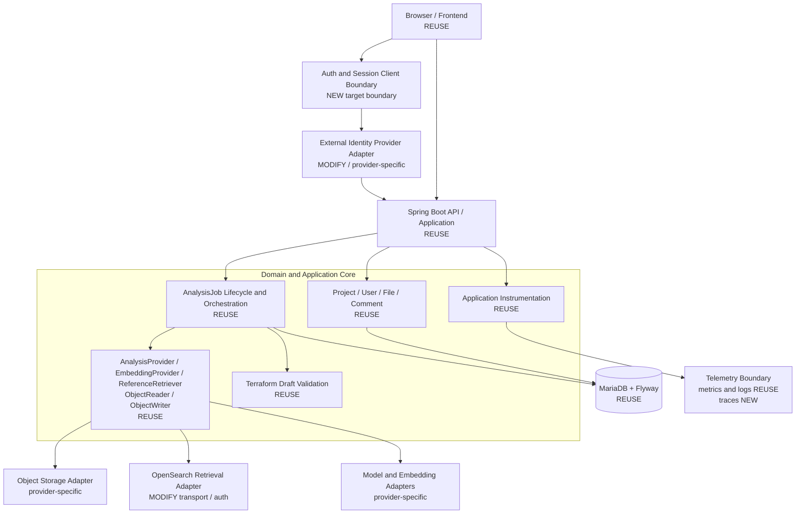
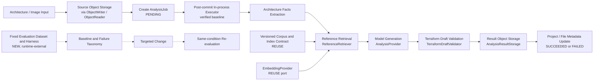

# Target Architecture

## Purpose

This document is the single logical target architecture for the current Terraformers
modernization project. It defines the separation between the reusable application core,
provider-neutral boundaries, provider-specific adapters, and capabilities that still require
implementation or evidence. It does not describe a migration from one cloud to another and does
not make historical AWS implementations part of the active target.

The current deployment target is GCP, but deployment topology and product selection belong in
separate deployment decisions. In particular, this document does not select GCP services, network
layout, capacity, identity products, or an observability backend.

The status terms used throughout are:

- **REUSE** — exists now and remains part of the target.
- **MODIFY** — exists now, but its provider coupling must be moved behind a neutral boundary.
- **NEW** — a required target capability is confirmed absent from the repository; the product or
  implementation remains undecided.
- **DEFER** — no architecture choice is made until reproducible evidence passes the change gate.
- **HISTORICAL** — an AWS-era implementation or delivery reference, not an active target component.

## Architecture principles

1. The Spring Boot application remains the center of the logical architecture. Existing project,
   user, file, comment, and analysis behavior is evolved rather than decomposed into new services.
2. Domain and application orchestration depend on contracts, not cloud SDKs, product names,
   transport authentication, or resource naming.
3. MariaDB with Flyway, the integrated Java `AnalysisJob` lifecycle, the versioned RAG corpus, and
   the Kubernetes-compatible workload contract remain the verified baseline.
4. Provider integrations are adapters. Historical adapters are retained as compatibility and
   design references, not assumed to be the target runtime.
5. Reliability changes begin with reproducible failure experiments. AI/RAG changes begin with a
   fixed evaluation baseline. Observability is complete only when its signals support actual root
   cause analysis, not merely when a dashboard exists.
6. Substantive technology choices remain **DEFER** unless an observed problem, reproducible
   evidence, a directly relevant proposed change, and same-condition revalidation are all present.

## Overall logical architecture

**Diagram legend:** nodes marked **REUSE** are present reusable responsibilities or contracts;
**MODIFY** and “target boundary” identify provider-neutralization work rather than current neutral
implementations; **NEW** identifies a confirmed capability gap that still requires evidence-led
design. Unmarked provider-specific adapter nodes are extension points, not selected products.

The frontend reaches the Spring Boot API while obtaining and maintaining authentication through a
separate logical session boundary. The application owns business rules and lifecycle orchestration;
adapters implement external identity, object, retrieval, model/embedding, and telemetry concerns.
This is a logical dependency model, not a statement that every box is a separately deployed
service.

## Component responsibilities

### Domain and application core

- **REUSE — project and ownership:** `projectcore` and `project` preserve ownership/access,
  visibility, metadata, artifact, draft, and compatible API behavior.
- **REUSE — internal users:** internal `user_id`, profile/display name, role, and status remain the
  business identity used for project ownership and comment attribution.
- **REUSE — files and comments:** project file metadata/tree projection and project comment
  ownership/visibility behavior remain application responsibilities. Object bytes stay outside the
  relational domain model.
- **REUSE — analysis lifecycle:** the integrated Java lifecycle owns job creation, state changes,
  scheduling, execution, progress/failure classification, result persistence, and project/file
  metadata updates.

### Provider-neutral ports and adapters

- **REUSE:** `AnalysisProvider`, `EmbeddingProvider`, `ReferenceRetriever`, `ObjectReader`, and
  `ObjectWriter` are application-facing ports.
- **REUSE:** `TerraformDraftValidator` is the validation boundary before a generated draft is
  accepted and persisted.
- **REUSE:** `AnalysisResultStorage`, `UploadObjectStorageService`, and
  `SourceObjectReaderService` apply application ownership, key, metadata, and result-storage rules
  through object storage ports.
- **MODIFY:** external identity claim decoding/mapping, model and embedding SDK integrations,
  object storage implementations, and OpenSearch transport/authentication remain replaceable
  provider adapters. Their product-specific types must not enter domain contracts.
- **MODIFY:** `ProgressPublisher` remains a port; its SQS implementation is historical/provider
  specific and is not a mandatory queue architecture.

## Analysis and AI/RAG flow

**Diagram legend:** solid arrows describe the existing/reused runtime responsibility chain. The
facts → retrieval → generation → validation ordering is the target pipeline principle. The dotted
evaluation chain is a **NEW**, evidence-required engineering capability outside the serving
runtime; it does not introduce an orchestration framework or service.

The current code maps this flow as follows:

| Logical responsibility | Current component | Status |
|---|---|---|
| Job creation, transition, and scheduling | `AnalysisJobService`, analysis job entity/repository, `AnalysisExecutorConfig` | **REUSE** |
| Facts extraction | `BedrockArchitectureFactsExtractor` behind the analysis/retrieval flow | **MODIFY** adapter; Bedrock-specific implementation is historical/provider-specific |
| Reference retrieval | `ReferenceRetriever`, `RetrievalModeReferenceRetriever`, `RetrievalQueryTextBuilder` | **REUSE** contract/query behavior |
| Query embedding | `EmbeddingProvider` | **REUSE** port |
| Draft generation | `AnalysisProvider` | **REUSE** port |
| Draft validation | `TerraformDraftValidator` | **REUSE** |
| Result and metadata persistence | `AnalysisResultStorage`, object ports, project/file repositories | **REUSE** |

The bounded in-process Java executor scheduled after transaction commit is the **verified
baseline and subject of later reliability experiments**. Restart durability, saturation handling,
durable handoff, queue/broker use, and transactional outbox use are not decided. They require
failure injection against the current lifecycle, invariant checks, and same-scenario revalidation
before any architecture change.

AI/RAG quality work is distinct from runtime execution. The required improvement path is: fixed
evaluation dataset → baseline → failure taxonomy → targeted change → same-condition
re-evaluation. The repository has a versioned corpus and deterministic corpus/ingestion checks, but
the fixed evaluation dataset, scoring harness, and comparison report are a confirmed **NEW** gap.
No specific evaluator, model, embedding model, metric threshold, or agent framework is selected.

## Identity boundary

### Frontend session

The existing authenticated/guest/checking state machine, protected navigation, API authentication
failure handling, and screen/business flow are **REUSE**. Direct Amplify/Cognito SDK calls,
Cognito configuration, token acquisition, and provider-specific messages are **MODIFY** concerns.

The target dependency direction is:

`Frontend → provider-neutral auth/session client boundary → external identity provider adapter`

The neutral frontend auth client is a confirmed **NEW** implementation gap, so this direction is a
target boundary rather than a description of current code. No identity provider is selected.

### Backend identity

Internal business identity remains separate from the external authentication subject. Internal
`user_id`, profile, display name, role, status, ownership, and attribution are **REUSE**. The
`cognito_sub`/`cognitoSub` naming, `findByCognitoSub`, Cognito claim/username interpretation, and
Cognito-specific errors are **MODIFY**.

The target maps an external provider/issuer and subject through a provider-neutral boundary to the
internal user. Claim interpretation belongs in an identity adapter. This document neither chooses
an IdP nor specifies schema migration mechanics; compatibility and uniqueness must be validated
when that work is designed.

## Persistence and object storage

MariaDB remains the relational system of record, with Flyway as the production schema evolution
contract. It stores internal users, projects, project file metadata, comments, analysis jobs, and
lifecycle state. Existing migrations remain immutable and application repositories continue to
express domain persistence.

Object storage holds uploaded source objects, generated/result objects, and other byte/blob
payloads. Application services access them through `ObjectReader` and `ObjectWriter`, retaining
content, metadata, locator, authorization, and key rules independently of a storage provider. S3
readers/writers are historical provider-specific adapters. This architecture does not select GCS
or any other concrete object storage implementation.

## Retrieval boundary

The OpenSearch-based retrieval architecture is retained without retaining AWS transport as a core
assumption:

- **REUSE:** `ReferenceRetriever`, structured query construction, response parsing, optional
  retrieval mode, and the versioned corpus/index logical contract.
- **MODIFY:** SigV4, `AWS4Auth`, `aoss` service assumptions, endpoint authentication, and the
  corresponding ingestion transport.
- **NEW:** a provider-neutral OpenSearch transport/authentication implementation boundary for both
  runtime retrieval and batch ingestion. The authentication product and credential mechanism are
  undecided.

Query embedding model and dimension must remain compatible with the ingested corpus/index
contract, but this document selects neither a model nor an OpenSearch hosting topology.

## Observability boundary

Micrometer application metrics, Actuator health/Prometheus contracts, MDC correlation semantics,
and application-level analysis/provider/retrieval failure metrics are **REUSE**. CloudWatch export,
dashboards, alarms, and EKS integrations are **HISTORICAL** deployment concerns.

The target telemetry boundary can carry metrics, logs, and traces and enables correlation across:

`request → AnalysisJob → retrieval → model/provider → validation → result`

Request/correlation ID, analysis job ID, and trace ID are the relevant correlation concepts.
Repository-owned trace propagation, export, and end-to-end trace validation are currently absent,
so tracing is a **NEW** gap—not a description of the current runtime. The tracing SDK, exporter,
backend, and deployment topology remain undecided. Completion means that a real injected or
observed failure can be diagnosed with signal evidence and its recovery verified; backend or
dashboard installation alone is insufficient.

## Runtime boundary

The logical runtime chain is:

`Application workload → immutable container image/SHA → Kubernetes-compatible workload/runtime contract → provider-specific deployment implementation`

The backend Docker image, Kubernetes base/local workload contract, health probes, runtime
configuration contract, and deterministic validation are **REUSE**. Provider-specific deployment
implements this contract without changing domain interfaces. Existing EKS overlays, Argo CD
runtime configuration, and AWS integrations are **HISTORICAL** references.

This document does not determine GKE use or topology, nodes, VM sizes, autoscaling, ingress,
network/subnets/IPs, load balancers, or concrete database/object-storage hosting. GCP runtime/IaC
is a confirmed **NEW** repository gap, but its design belongs to a separate evidence-based
deployment decision.

## Reuse / modify / new / deferred map

| Status | Logical boundary or capability |
|---|---|
| **REUSE** | Spring Boot API/application; project/user/file/comment flows; internal identity semantics; integrated `AnalysisJob` lifecycle; provider ports; Terraform draft validation; MariaDB/Flyway; versioned corpus and corpus contract; object-storage application services; Micrometer/health/correlation contracts; container and Kubernetes workload contract; deterministic tests/checks |
| **MODIFY** | Frontend Amplify/Cognito binding; backend Cognito subject/claim binding; provider-specific model/embedding adapters; S3 adapters; SQS progress adapter isolation; SigV4/AOSS retrieval and ingestion transport/authentication |
| **NEW** | Provider-neutral frontend auth client and backend external-subject/claim boundary; portable OpenSearch transport/auth implementation; fixed AI/RAG evaluation dataset/harness/report; reliability/failure-injection harness; trace propagation/export/validation capability; GCP runtime/IaC (outside this logical design) |
| **DEFER** | Technology/product and topology choices lacking observed-problem evidence and a same-condition validation plan |
| **HISTORICAL** | AWS adapters, infrastructure, runtime overlays, observability deployment, delivery workflows, and live-operation assumptions retained as compatibility/reference assets |

“NEW” identifies a capability gap, not permission to select a product. Each substantive
implementation still passes the change gate and preserves **REUSE** contracts.

## Historical AWS implementation

The following are historical/provider-specific implementations and are not active target
architecture components: Cognito; Amplify Cognito integration; Bedrock analysis and embedding;
S3; the SQS adapter; AOSS/SigV4; CloudWatch; AWS Terraform stacks; AWS deployment workflows; and
EKS-specific runtime integrations. They remain in the repository for compatibility, reproducible
baseline evidence, and reference. This architecture does not require their deletion.

Reusable patterns from that implementation include provider abstraction, immutable image/SHA,
state separation, least privilege, deployment approval gates, plan/apply separation, evidence
collection, and deterministic validation. Those patterns do not imply reuse of an AWS product or
live AWS state.

## Explicitly deferred decisions

The following are not selected or included as target components without evidence and a separate
decision:

- RabbitMQ, Transactional Outbox, Kafka, or any other queue/broker/durable handoff design;
- LangGraph, agent/multi-agent architecture, persistent Python AI service/worker, or service
  decomposition;
- Keycloak, Redis, or a concrete GCP identity provider;
- a concrete GCP managed database or other managed-service product;
- GKE topology, node count, VM size, autoscaling, ingress, networking, or load balancing;
- exact OpenSearch hosting topology or authentication/credential mechanism;
- a specific generation model, embedding model, evaluator, or arbitrary performance/quality
  target;
- an exact observability backend, SDK/exporter, dashboard, or deployment topology;
- restart recovery, executor saturation, durable handoff, and orphan-object policy until
  reliability experiments establish the failure and required invariants;
- cost/quota sizing and all other deployment-capacity decisions.

## Evidence and references

This architecture is derived from current repository evidence and the accepted decisions, not the
historical project-direction document:

- [Repository working contract](../../AGENTS.md)
- [Component inventory](component-inventory.md)
- [ADR-001: Define modernization project scope](decisions/ADR-001-project-scope.md)
- [ADR-002: Preserve cloud-neutral application boundaries](decisions/ADR-002-cloud-neutral-boundaries.md)
- [ADR-003: Require evaluation before AI/RAG complexity](decisions/ADR-003-evaluation-before-complexity.md)
- [ADR-004: Gate architectural changes on reproducible evidence](decisions/ADR-004-change-gates.md)

Current implementation mappings referenced above are rooted in:

- `backend/src/main/java/com/terraformers/modernization/analysis/`
- `backend/src/main/java/com/terraformers/modernization/reference/`
- `backend/src/main/java/com/terraformers/modernization/storage/`
- `backend/src/main/java/com/terraformers/modernization/identity/`
- `backend/src/main/java/com/terraformers/modernization/security/`
- `backend/src/main/java/com/terraformers/modernization/projectcore/`
- `backend/src/main/java/com/terraformers/modernization/project/`
- `backend/src/main/java/com/terraformers/modernization/projecttree/`
- `backend/src/main/java/com/terraformers/modernization/projectcomment/`
- `frontend/src/auth/`, `frontend/src/utils/api.js`, and `frontend/src/awsConfig.js`
- `backend/src/main/resources/db/migration/`, `corpus/terraformers-reference/`,
  `infra/kubernetes/base/`, and `infra/terraform/runtime-contract/`
