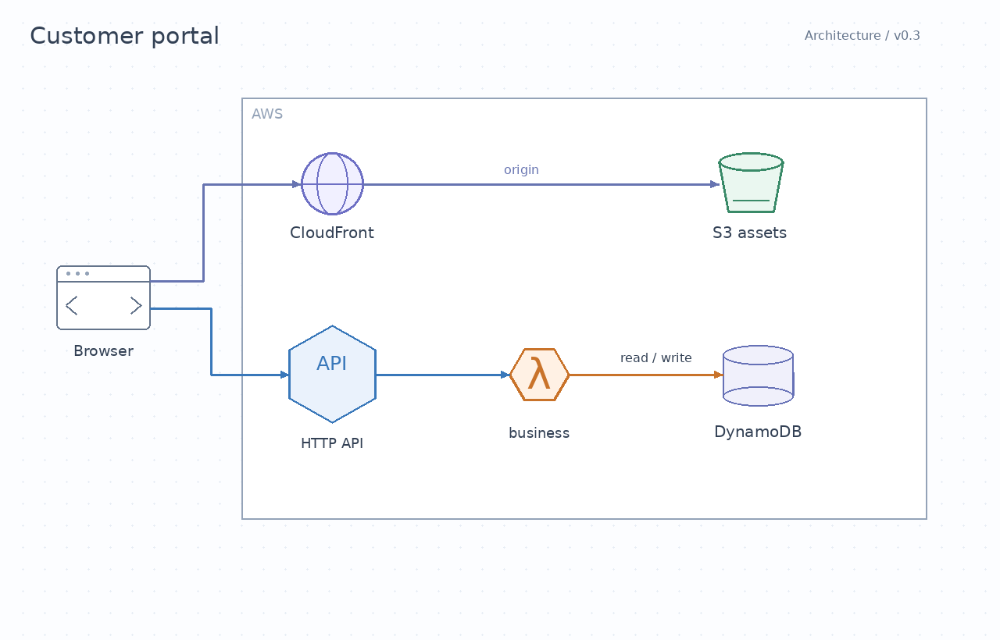
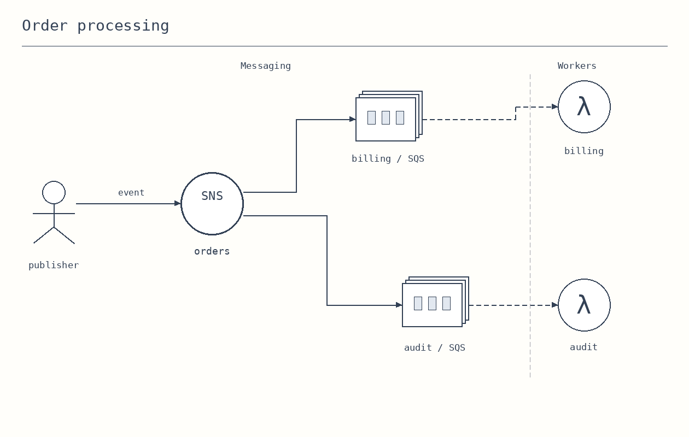
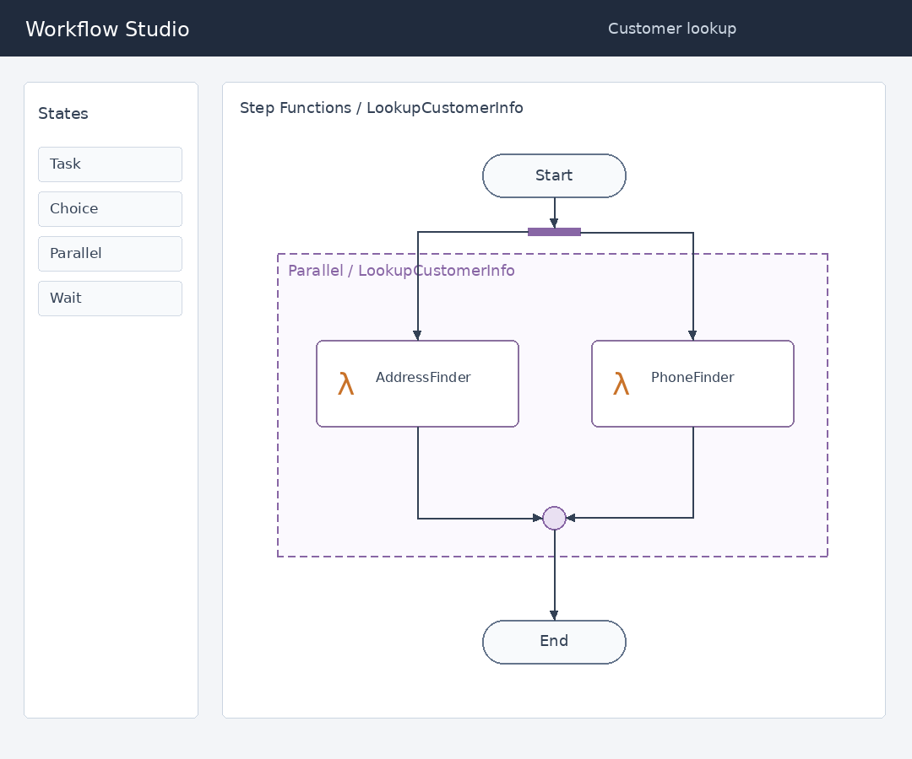
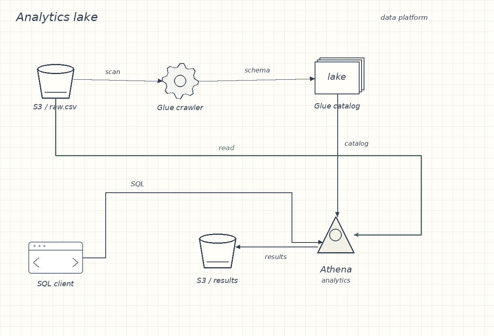
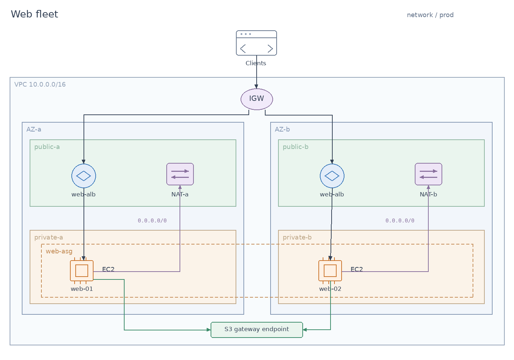
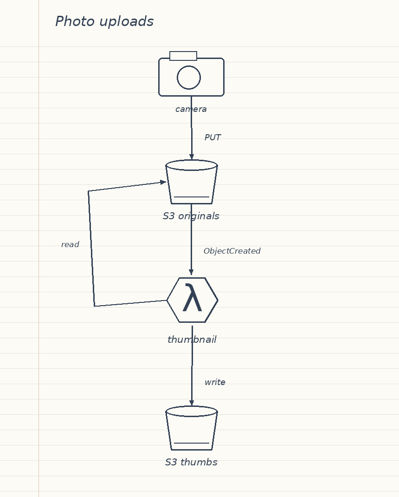
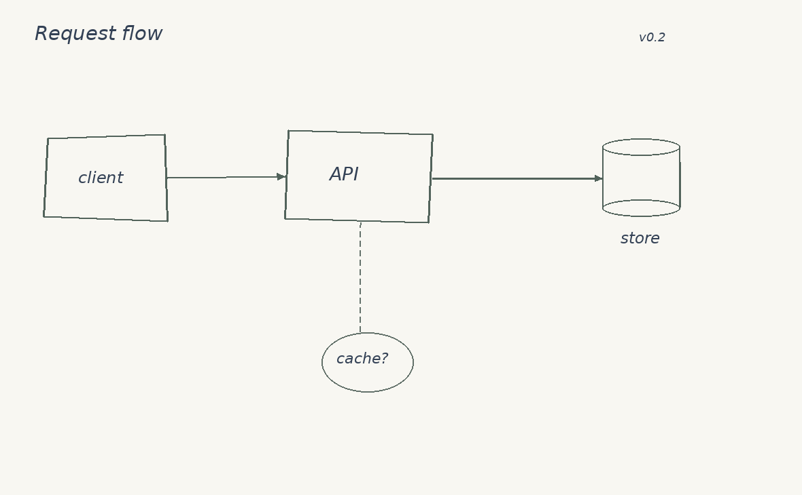
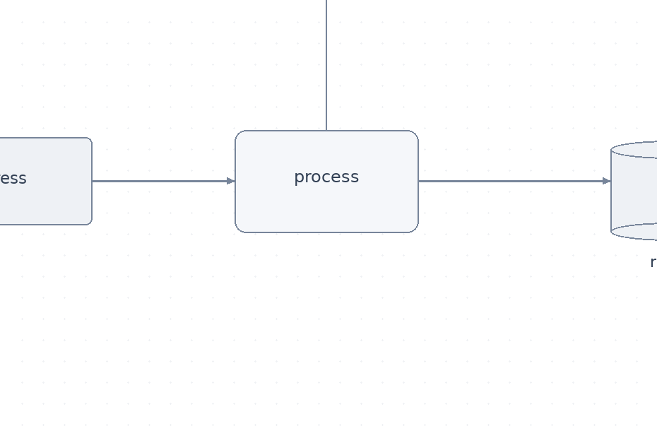
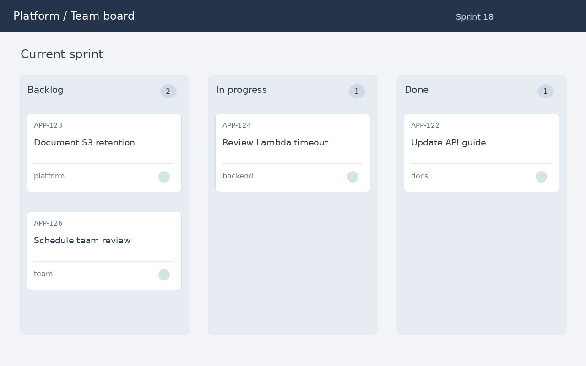
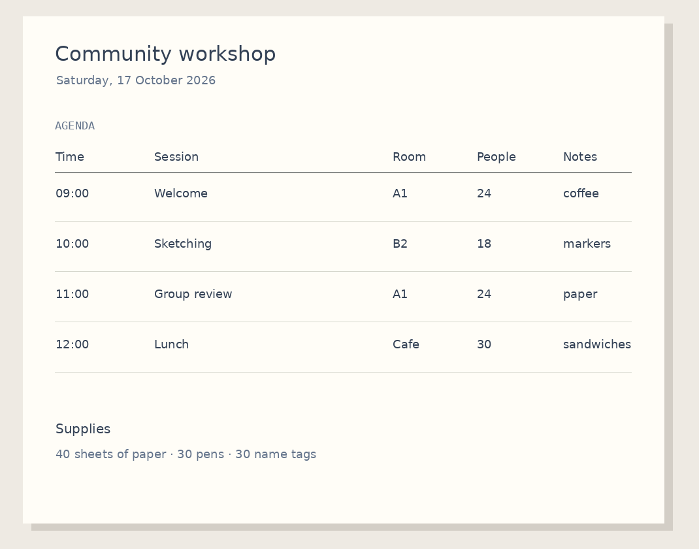

# PT-1 revised realistic-input candidate: human truth-freeze review

**CANDIDATE REVISION 2 / HUMAN_REQUIRED: REALISTIC_DATASET_TRUTH_FREEZE**

The prior candidate was not approved. This explicitly human-authorized bounded corrective iteration removes answer leakage and varies visual presentation within the original PT-1 objective, path scope and acceptance. It is not a second autonomous repair. Topology/classification/resource expectation fields in `dataset.json` are unchanged; PNG/SVG inputs and review/provenance presentation are revised.

## Execution and candidate history

- Execution base remains `0bb244756c2a2e1d3d6d11d0342e98e155f8662c`; branch `codex/product-trust-pt-1-realistic-input-benchmark` and [PR #241](https://github.com/siamese-lang/terraformers-platform/pull/241) are reused.
- Human review started from PR head `2cf8a73889c6f612f5594cc7620c503646642892`. Remote main matched the bound base at recovery. No new branch, activation/rebinding, refresh or rebase was performed.
- Superseded candidate-1 identity: `8bc6daebde25045fcbb0a0bdad6deaedf2e9edeb29a28b39290fc107b6e952d8`. Its exact old identity is [archived](../../evaluation/terraformers-realistic-v1/superseded/candidate-01-identity.json); [history](../../evaluation/terraformers-realistic-v1/candidate-history.json) records human-review rejection. Old assets/truth are retrievable from the immutable reviewed head, not claimed to match current bytes.
- New candidate-2 identity: `c34a9b4b3b307d09dd2688e0feac3f91c4648e71166df4005b23e7b40eb9b852`. [candidate-identity.json](../../evaluation/terraformers-realistic-v1/candidate-identity.json) pins 25 files including both history and the archived old identity. This is a new, unapproved identity.
- The historical one autonomous mechanical repair remains recorded as one. This separate human-review corrective iteration is recorded as one, with no autonomous repair-limit increase.
- `truthApprovedBy`/`truthFrozenAt` remain null; `modelUnderTestRunCount` remains 0. No Terraformers, Vertex, Gemini or other live/image-generation model call, live GCP action or output-driven fixture tuning occurred.

## What changed and what is still unproven

All input-only benchmark/provenance footers and sentences teaching required/forbidden interpretations were removed. Titles are normal document/diagram titles. The six positives now use colored service symbols, a monochrome messaging sketch, an original workflow-editor screen, a dense graph-paper data sketch, a nested network export and a portrait notebook sketch. Controls are an ordinary unfinished sketch, a genuinely partial export, a work-item board and an agenda without self-classification text.

All drawings and symbols are repository-owned constructions: no official/public AWS artwork, icons, screenshots or unclear-license asset pack was copied. Existing source specifications and redistribution/recreation records are retained. These are still reference-based recreations, not collected real user diagrams. Each case below makes that limitation explicit. No fidelity/false-trusted-success/latency/live product result is claimed; CI and loader PASS cannot freeze truth.

## Validation for this revision

- `mvn -o -f backend/pom.xml -Dtest=EvaluationDatasetLoaderTest test`: **4 tests, 0 failures, 0 errors, 0 skips; BUILD SUCCESS**, run once against the revised bytes. No test failure or rerun-until-green occurred. Production/test sources were already compiled and unchanged in this iteration.
- One-off manifest audit: **PASS** for all ten changed PNG SHA-256 values, ten SVG hashes/XML, PNG decoding/absence of hidden metadata, all 25 new identity entries and the exact archived old identity SHA-256.
- Semantic/source preservation: **PASS**. Every dataset field other than `input` is identical to reviewed head `2cf8a73889c6f612f5594cc7620c503646642892`; source records, each case source IDs/basis, all six positive resource intents and acceptable semantic variants are unchanged.
- Input-only text audit and direct image inspection: **PASS**. All ten final inputs were viewed; SVG text was enumerated and checked for the cited answer/provenance/instruction phrases, and no SVG embeds third-party images. This finite scan supplements visual review; it does not prove absence of every possible semantic cue or human acceptance.
- `git diff --check`, staged scope audit and protected-path audit: **PASS**. No production/test Java change in this corrective iteration; canonical/holdout images, corpus, infrastructure and workflows are unchanged.
- Historical candidate-1 tests (10 focused then 4 after annotation correction) remain historical mechanism evidence only. Human review rejected that candidate despite those PASS results. They do not constitute acceptance of either candidate.

The current rendering/provenance correction does not alter production code, prompts/models, RAG/retrieval, scorer/evaluator behavior, corpus, workflows or acceptance criteria.

## Original acceptance review for the resubmitted candidate

| Original Work Package obligation | Concrete evidence; human gate stays pending |
| --- | --- |
| Small/diverse candidate, not repackaged synthetic inputs | Still 6 positive / 2 ambiguous / 2 non-architecture. Six positive visual grammars and distinct reference topologies; no historical input bytes/layout reused. Realism limitations are listed for each image, not declared solved by tests. |
| Pinned bytes / reproducible repository-owned representation | Ten newly pinned PNG/SVG pairs and 25-file candidate-2 identity; candidate-1 identity preserved and marked superseded. |
| Provenance / redistribution or recreation basis | Original source records and per-case source basis retained; all added symbols/UI/document geometry are original. No unlicensed artwork copied. |
| Reviewable positive components, relationships and resource intent | Every case below embeds actual bytes and full unchanged truth plus visual symbol mapping, acceptable variants and material forbidden interpretations. |
| Explicit control rejection truth | All four controls still forbid Terraform generation in the manifest; rejection reasons are in review/provenance, not explanatory input captions. |
| No model-under-test execution / output-driven edits | Run count stays 0; edits respond only to the user's visual human-review findings. No live or image-generation model call. |
| Existing synthetic datasets unchanged | Protected-path/base-to-branch audit passes; six reference topologies are retained rather than copying/restyling canonical/holdout assets. |
| No production behavior or live cloud change | Only allowed dataset/assets, review/provenance and durable-state documents change. No prompt/model/RAG/retrieval/scorer/evaluator change. |
| Case register and remaining uncertainties | All ten per-case sections include full truth, provenance, visual differences and realism limitations; human visual/truth confirmation remains pending. |
| Program stops at truth-freeze gate | State/WP remain HUMAN_REQUIRED, no approver or freeze timestamp, PT-2 ineligible and merge unapproved. |

Human-review deliverable findings are addressed by observable removal of the old teaching sentences and varied short-label/symbol/layout inputs. Realistic visual suitability and truth freeze are **resubmitted for human review**, not inferred from these checks.

## Per-case human review

The images embedded below are the exact candidate PNG inputs, not thumbnails with extra truth captions burned into them. Source/semantic labels and material forbidden interpretations are intentionally kept in this document/provenance only. Every case remains unapproved.

### pt1-01-serverless-portal

Input SHA-256: `ec58701f5a1c610208ef24e74d30cd5ae0f0b35c16d5aabf7b22163adae7e9b7`. Candidate classification: `ARCHITECTURE_DIAGRAM`.

**Provenance and asset basis.** AWS architecture blog describes S3/CloudFront presentation, API Gateway/Lambda business logic and DynamoDB data. Authentication omitted because no identity service is specified here. Original PT-1 contribution. Source pages inform factual topology only; their images, icons, screenshots and prose are not redistributed. Public accessibility is not treated as an artwork license.

- [Building a three-tier architecture on a budget | AWS Architecture Blog](https://aws.amazon.com/blogs/architecture/building-a-three-tier-architecture-on-a-budget/)

**Visual presentation.** Independent globe, bucket, hexagonal function/API and cylinder symbols; short labels; separate static/API lanes and bent ingress.

**Visible symbols/short labels mapped to source truth:**

- Browser symbol / Browser -> Browser users
- globe / CloudFront -> Amazon CloudFront
- bucket / S3 assets -> Amazon S3 website assets
- hexagon / HTTP API -> Amazon API Gateway HTTP API
- λ / business -> AWS Lambda business logic
- cylinder / DynamoDB -> Amazon DynamoDB application table

**Required components:** Browser users; Amazon CloudFront; Amazon S3 website assets; Amazon API Gateway; AWS Lambda business logic; Amazon DynamoDB application table.

**Required relationships:**

- Browser users -> Amazon CloudFront
- Amazon CloudFront -> Amazon S3 website assets
- Browser users -> Amazon API Gateway
- Amazon API Gateway -> AWS Lambda business logic
- AWS Lambda business logic -> Amazon DynamoDB application table

**Resource intent:**

- Separate static S3 origin and HTTP API paths; Lambda owns business logic and DynamoDB stores application records.

Required resource types: `aws_cloudfront_distribution`, `aws_s3_bucket`, `aws_apigatewayv2_api`, `aws_lambda_function`, `aws_dynamodb_table`.

Acceptable semantic variants: Service-name synonyms are acceptable; support resources are allowed. HTTP API annotation binds the v2 API resource, not a REST API swap.

Allowed support types: `aws_apigatewayv2_integration`, `aws_apigatewayv2_route`, `aws_apigatewayv2_stage`, `aws_lambda_permission`, `aws_iam_role`, `aws_iam_policy`, `aws_cloudfront_origin_access_control`.

**Forbidden interpretations:**

- Components: Application Load Balancer; RDS Database; EKS.
- Relationships: Amazon CloudFront -> Application Load Balancer.
- Resource types: `aws_lb`, `aws_db_instance`, `aws_eks_cluster`.

**Difference from the existing synthetic benchmark.** The canonical CloudFront case uses private ALB/EKS and the three-tier case uses ALB/RDS. This source topology instead has a static S3 origin alongside an HTTP API/Lambda/DynamoDB path, drawn as service symbols rather than the canonical text boxes. No canonical bytes or layout were reused.

**Remaining realism limitation.** A deliberately composed vector export, not a collected portal diagram. S3/CloudFront/DynamoDB text still aids recognition; the original symbols do not test official AWS icon recognition.

**Truth uncertainty / human decision.** No new factual guess or semantic-truth weakening is introduced. Human confirmation of this revised visual, symbol mapping, source fidelity and classification remains pending; neither this prose nor a passing test approves truth.

### pt1-02-order-fanout

Input SHA-256: `f78bb2a4f0e66df7cc1f613aa739997b433a6757ee7f2d15a213d4c4e772194c`. Candidate classification: `ARCHITECTURE_DIAGRAM`.

**Provenance and asset basis.** Composition of documented SNS-to-SQS fanout and Lambda SQS event-source mapping. Billing/audit names are original concrete roles; no storage destination is invented. Original PT-1 contribution. Source pages inform factual topology only; their images, icons, screenshots and prose are not redistributed. Public accessibility is not treated as an artwork license.

- [Fanout Amazon SNS notifications to Amazon SQS queues for asynchronous processing - Amazon Simple Notification Service](https://docs.aws.amazon.com/sns/latest/dg/sns-sqs-as-subscriber.html)
- [Using Lambda with Amazon SQS - AWS Lambda](https://docs.aws.amazon.com/lambda/latest/dg/with-sqs.html)

**Visual presentation.** Actor, circular SNS topic, offset queue stacks, circular λ workers, role labels and solid/dashed orthogonal connectors; asymmetric queue placement.

**Visible symbols/short labels mapped to source truth:**

- actor / publisher -> Order publisher
- circle / SNS orders -> Amazon SNS orders topic
- queue stack / billing SQS -> Amazon SQS billing queue
- queue stack / audit SQS -> Amazon SQS audit queue
- λ / billing -> AWS Lambda billing worker
- λ / audit -> AWS Lambda audit worker

**Required components:** Order publisher; Amazon SNS orders topic; Amazon SQS billing queue; Amazon SQS audit queue; AWS Lambda billing worker; AWS Lambda audit worker.

**Required relationships:**

- Order publisher -> Amazon SNS orders topic
- Amazon SNS orders topic -> Amazon SQS billing queue
- Amazon SNS orders topic -> Amazon SQS audit queue
- Amazon SQS billing queue -> AWS Lambda billing worker
- Amazon SQS audit queue -> AWS Lambda audit worker

**Resource intent:**

- One SNS topic fans out to two distinct SQS queues. Each queue feeds its own Lambda consumer using an event-source mapping; queue policy allows SNS delivery.

Required resource types: `aws_sns_topic`, `aws_sns_topic_subscription`, `aws_sqs_queue`, `aws_sqs_queue_policy`, `aws_lambda_function`, `aws_lambda_event_source_mapping`.

Acceptable semantic variants: Relationship arrows denote event/data flow; Lambda polls SQS rather than SQS invoking Lambda directly.

Allowed support types: `aws_iam_role`, `aws_iam_policy`.

**Forbidden interpretations:**

- Components: Amazon API Gateway; RDS Database.
- Relationships: Amazon SNS orders topic -> AWS Lambda billing worker; Amazon SNS orders topic -> AWS Lambda audit worker.
- Resource types: `aws_db_instance`.

**Difference from the existing synthetic benchmark.** SNS-to-two-SQS-to-two-Lambda fanout is absent from the canonical/holdout positive topologies. Monospaced ink, actor/queue symbols and dashed consumer links replace the common colored rectangle grammar without restyling a canonical fixture.

**Remaining realism limitation.** Original messaging sketch with readable SNS/SQS labels; it is not a real exported deployment diagram and has no screenshot noise. Dashed links are diagram notation, not a measurement of consumer runtime behavior.

**Truth uncertainty / human decision.** No new factual guess or semantic-truth weakening is introduced. Human confirmation of this revised visual, symbol mapping, source fidelity and classification remains pending; neither this prose nor a passing test approves truth.

### pt1-03-parallel-lookup

Input SHA-256: `b61251fada65971e1ba92557577861085a1c7df325b8c048bbb38b69f88a89a8`. Candidate classification: `ARCHITECTURE_DIAGRAM`.

**Provenance and asset basis.** Independent redraw of the documented LookupCustomerInfo parallel example with AddressFinder and PhoneFinder Lambda tasks, preserving both terminal branches. Original PT-1 contribution. Source pages inform factual topology only; their images, icons, screenshots and prose are not redistributed. Public accessibility is not treated as an artwork license.

- [Parallel workflow state - AWS Step Functions](https://docs.aws.amazon.com/step-functions/latest/dg/state-parallel.html)

**Visual presentation.** Editor chrome and palette surrounding a state graph; rounded task nodes, λ symbols, Parallel boundary, fork bar, join and Start/End nodes.

**Visible symbols/short labels mapped to source truth:**

- Step Functions header -> AWS Step Functions state machine
- Parallel / LookupCustomerInfo boundary and fork -> Parallel LookupCustomerInfo
- λ / AddressFinder -> AWS Lambda AddressFinder
- λ / PhoneFinder -> AWS Lambda PhoneFinder
- join / End -> End / result array (logical output, not storage)

**Required components:** AWS Step Functions state machine; Parallel LookupCustomerInfo; AWS Lambda AddressFinder; AWS Lambda PhoneFinder.

**Required relationships:**

- Parallel LookupCustomerInfo -> AWS Lambda AddressFinder
- Parallel LookupCustomerInfo -> AWS Lambda PhoneFinder
- AWS Lambda AddressFinder -> End / result array
- AWS Lambda PhoneFinder -> End / result array

**Resource intent:**

- A Step Functions Parallel state invokes two distinct Lambda tasks and joins their outputs. Workflow states are not separately deployed cloud services.

Required resource types: `aws_sfn_state_machine`, `aws_lambda_function`, `aws_iam_role`.

Acceptable semantic variants: Parallel/join can be described in words rather than as separate components; terminal result array is logical output, not a database.

Allowed support types: `aws_iam_policy`, `aws_iam_role_policy`.

**Forbidden interpretations:**

- Components: Amazon SQS; Amazon SNS; RDS Database.
- Relationships: AWS Lambda AddressFinder -> AWS Lambda PhoneFinder.
- Resource types: `aws_sqs_queue`, `aws_sns_topic`, `aws_db_instance`.

**Difference from the existing synthetic benchmark.** Canonical/holdout positives do not include a Step Functions parallel workflow or editing UI around the graph. The palette contains unused node types, so the graph and its containment must be distinguished from UI controls; this is not a restyled infrastructure chain.

**Remaining realism limitation.** A repository-owned mock editor, not an AWS console screenshot or exact Workflow Studio replica. Tasks and service context remain legible; human review must confirm that graph/palette separation and fork/join notation are natural enough.

**Truth uncertainty / human decision.** No new factual guess or semantic-truth weakening is introduced. Human confirmation of this revised visual, symbol mapping, source fidelity and classification remains pending; neither this prose nor a passing test approves truth.

### pt1-04-analytics-catalog

Input SHA-256: `7b13925481c47f774ee211516144c37ea4a3dfb88f68abbe00baaa83428e7dca`. Candidate classification: `ARCHITECTURE_DIAGRAM`.

**Provenance and asset basis.** AWS documentation specifies Athena querying S3 using Glue metadata and optional crawler schema inference. This drawing explicitly selects crawler, a named workgroup and a separate S3 query-output bucket. Original PT-1 contribution. Source pages inform factual topology only; their images, icons, screenshots and prose are not redistributed. Public accessibility is not treated as an artwork license.

- [Use AWS Glue Data Catalog to connect to your data - Amazon Athena](https://docs.aws.amazon.com/athena/latest/ug/data-sources-glue.html)

**Visual presentation.** Unfilled bucket, gear, document-stack and query symbols, oblique short labels, grid background, long data/catalog/SQL connector routes and non-junction crossings.

**Visible symbols/short labels mapped to source truth:**

- bucket / S3 raw.csv -> Amazon S3 source CSV objects
- gear / Glue crawler -> AWS Glue crawler
- stack / lake / Glue catalog -> AWS Glue Data Catalog lake database
- query symbol / Athena analytics -> Amazon Athena analytics workgroup
- bucket / S3 results -> Amazon S3 query results
- browser / SQL client -> Analyst SQL client

**Required components:** Amazon S3 source CSV objects; AWS Glue crawler; AWS Glue Data Catalog lake database; Amazon Athena analytics workgroup; Amazon S3 query results; Analyst SQL client.

**Required relationships:**

- Amazon S3 source CSV objects -> AWS Glue crawler
- AWS Glue crawler -> AWS Glue Data Catalog lake database
- AWS Glue Data Catalog lake database -> Amazon Athena analytics workgroup
- Amazon S3 source CSV objects -> Amazon Athena analytics workgroup
- Amazon Athena analytics workgroup -> Amazon S3 query results
- Analyst SQL client -> Amazon Athena analytics workgroup

**Resource intent:**

- Separate source and query-output buckets; crawler populates the Glue database with schema; Athena workgroup queries source objects and writes query results.

Required resource types: `aws_s3_bucket`, `aws_glue_crawler`, `aws_glue_catalog_database`, `aws_athena_workgroup`.

Acceptable semantic variants: Metadata lookup may be described as Athena -> Glue; read-direction descriptions may reverse the data-flow arrow when the read semantics remain explicit. Crawler may create tables dynamically.

Allowed support types: `aws_glue_catalog_table`, `aws_iam_role`, `aws_iam_policy`.

**Forbidden interpretations:**

- Components: RDS Database; AWS Lambda.
- Relationships: AWS Glue crawler moves objects into AWS Glue Data Catalog.
- Resource types: `aws_db_instance`, `aws_lambda_function`.

**Difference from the existing synthetic benchmark.** A crawler/catalog/query path separating schema from object flow is absent from the canonical/holdout positives. Dense metadata/data routes and original service symbols require more than reading a linear list of full service names.

**Remaining realism limitation.** Vector graph paper and a regular oblique font approximate a sketch; they do not reproduce handwriting, camera artifacts or proprietary diagram icons. S3/Glue/Athena labels still identify service families.

**Truth uncertainty / human decision.** No new factual guess or semantic-truth weakening is introduced. Human confirmation of this revised visual, symbol mapping, source fidelity and classification remains pending; neither this prose nor a passing test approves truth.

### pt1-05-private-web-fleet

Input SHA-256: `4de17a100ac94ea9cd4c61be505fad45cc99dd3cb066fb484b7cbc2f5b50be32`. Candidate classification: `ARCHITECTURE_DIAGRAM`.

**Provenance and asset basis.** Independent redraw of documented two-AZ public/private VPC, ALB and Auto Scaling private servers, one NAT per AZ and S3 gateway endpoint. Select IPv4-only explicitly; two ALB nodes represent one logical load balancer. Original PT-1 contribution. Source pages inform factual topology only; their images, icons, screenshots and prose are not redistributed. Public accessibility is not treated as an artwork license.

- [Example: VPC with servers in private subnets and NAT - Amazon Virtual Private Cloud](https://docs.aws.amazon.com/vpc/latest/userguide/vpc-example-private-subnets-nat.html)

**Visual presentation.** Colored VPC/AZ/public/private boundaries, small hub/route/chip symbols, shared web-alb/web-asg names, per-AZ NAT labels and bent egress/endpoint routes.

**Visible symbols/short labels mapped to source truth:**

- VPC 10.0.0.0/16 -> VPC (IPv4)
- AZ-a / AZ-b and public-a/public-b/private-a/private-b -> two AZs with public/private subnets
- IGW -> Internet gateway
- two hub symbols / web-alb -> one Application Load Balancer across AZs
- NAT-a / NAT-b -> NAT gateway A / B
- chips / EC2 web-01 / web-02 -> EC2 server A / B
- dashed web-asg boundary -> Auto Scaling group
- S3 gateway endpoint -> S3 gateway VPC endpoint

**Required components:** VPC; Public subnet A; Public subnet B; Private subnet A; Private subnet B; Internet gateway; Application Load Balancer; NAT gateway A; NAT gateway B; EC2 server A; EC2 server B; Auto Scaling group; S3 gateway VPC endpoint.

**Required relationships:**

- Internet clients -> Application Load Balancer
- Application Load Balancer -> EC2 server A
- Application Load Balancer -> EC2 server B
- EC2 server A -> NAT gateway A
- EC2 server B -> NAT gateway B
- EC2 servers -> S3 gateway VPC endpoint

**Resource intent:**

- Two public and two private subnets across two AZs; one logical ALB and ASG; ASG instances are supplied by a launch template, not mandatory standalone aws_instance resources. One NAT per AZ, private egress routing and S3 gateway endpoint.

Required resource types: `aws_vpc`, `aws_subnet`, `aws_internet_gateway`, `aws_lb`, `aws_autoscaling_group`, `aws_launch_template`, `aws_nat_gateway`, `aws_route_table`, `aws_vpc_endpoint`, `aws_security_group`.

Acceptable semantic variants: Route entries may be inline or standalone; ALB/ASG node placement can be expressed as shared resources. No IPv6 or egress-only gateway required.

Allowed support types: `aws_route`, `aws_route_table_association`, `aws_eip`, `aws_lb_listener`, `aws_lb_target_group`, `aws_vpc_endpoint_route_table_association`.

**Forbidden interpretations:**

- Components: RDS Database; EKS; CloudFront.
- Relationships: Internet clients -> EC2 servers directly; EC2 server A -> NAT gateway B.
- Resource types: `aws_db_instance`, `aws_eks_cluster`, `aws_cloudfront_distribution`.

**Difference from the existing synthetic benchmark.** Unlike the canonical ALB/RDS three-tier case and holdout SG/RDS case, this topology has an ASG private EC2 fleet, NAT per AZ and an S3 gateway endpoint. Nested boundaries and a shared cross-AZ group carry intent; no historical drawing was copied or merely restyled.

**Remaining realism limitation.** A clean network export with only two AZs and short legible labels; no tool-specific AWS icons or real production topology are claimed. Shared web-alb and web-asg labels need human visual confirmation against the unchanged one-ALB/one-ASG semantic intent.

**Truth uncertainty / human decision.** No new factual guess or semantic-truth weakening is introduced. Human confirmation of this revised visual, symbol mapping, source fidelity and classification remains pending; neither this prose nor a passing test approves truth.

### pt1-06-thumbnail-pipeline

Input SHA-256: `b41f87b2f8afa2fb60496b8a68289d804748a6d881d8d46cba2df13241b6578c`. Candidate classification: `ARCHITECTURE_DIAGRAM`.

**Provenance and asset basis.** The S3 Lambda documentation describes object-created notifications, invocation permission and using two buckets to prevent recursive output triggers. Thumbnail processing is an explicitly labeled instance of that pattern. Original PT-1 contribution. Source pages inform factual topology only; their images, icons, screenshots and prose are not redistributed. Public accessibility is not treated as an artwork license.

- [Process Amazon S3 event notifications with Lambda - AWS Lambda](https://docs.aws.amazon.com/lambda/latest/dg/with-s3.html)

**Visual presentation.** Camera, bucket and λ symbols with terse role labels, ruled-paper background, oblique text and a bent source-read return edge.

**Visible symbols/short labels mapped to source truth:**

- camera -> Uploader camera client
- bucket / S3 originals -> Amazon S3 original images
- λ / thumbnail -> AWS Lambda thumbnail processor
- bucket / S3 thumbs -> Amazon S3 thumbnail output

**Required components:** Uploader camera client; Amazon S3 original images; AWS Lambda thumbnail processor; Amazon S3 thumbnail output.

**Required relationships:**

- Uploader camera client -> Amazon S3 original images
- Amazon S3 original images -> AWS Lambda thumbnail processor
- AWS Lambda thumbnail processor reads Amazon S3 original images
- AWS Lambda thumbnail processor -> Amazon S3 thumbnail output

**Resource intent:**

- Two distinct buckets; ObjectCreated notification on the source only; S3 invocation permission and Lambda execution-role access to read source/write output.

Required resource types: `aws_s3_bucket`, `aws_s3_bucket_notification`, `aws_lambda_function`, `aws_lambda_permission`, `aws_iam_role`.

Acceptable semantic variants: Service synonyms and equivalent IAM support resources are acceptable; merging buckets is excluded by this explicitly chosen two-bucket diagram.

Allowed support types: `aws_iam_policy`, `aws_iam_role_policy`, `aws_s3_bucket_public_access_block`.

**Forbidden interpretations:**

- Components: Amazon SQS; RDS Database.
- Relationships: Amazon S3 thumbnail output -> AWS Lambda thumbnail processor.
- Resource types: `aws_sqs_queue`, `aws_db_instance`.

**Difference from the existing synthetic benchmark.** This event-driven S3-to-Lambda-to-S3 processing topology differs from the canonical Spring Boot/MariaDB/object-content split. Its portrait symbol sketch and reverse read connector were constructed from the S3 event specification, not a restyled canonical image.

**Remaining realism limitation.** Synthetic notebook texture and regular font; not an actual photographed notebook. Original symbols and S3/λ cues narrow interpretation; the set does not establish performance on arbitrary hand-drawn or official-icon diagrams.

**Truth uncertainty / human decision.** No new factual guess or semantic-truth weakening is introduced. Human confirmation of this revised visual, symbol mapping, source fidelity and classification remains pending; neither this prose nor a passing test approves truth.

### pt1-07-unresolved-design

Input SHA-256: `3fe4fbd6b7dcf95185eea8f112cf27231f45f7bbb2ceac6e5172a44c51903835`. Candidate classification: `AMBIGUOUS`.

**Provenance and asset basis.** Original repository-owned design-notes control. It deliberately leaves provider, services and connectivity decisions unresolved. Original PT-1 contribution. Source pages inform factual topology only; their images, icons, screenshots and prose are not redistributed. Public accessibility is not treated as an artwork license.

**Visual presentation.** Generic client/API/store nodes, an optional cache? bubble, uneven strokes and a dashed side link; no classification or rejection caption.

**Visible symbols/short labels mapped to source truth:**

- client, API, store and cache? are generic roles; no AWS resource family is identified

**Required components:** None; no provider-specific components are required for this rejection control..

**Required relationships:**

- None; no deployable provider-specific relationships are inferred.

**Resource intent:**

- Terraform must not be generated. Generic client/API/store roles and an optional cache do not specify a cloud provider, concrete deployable services or deployment/security boundaries. Do not invent provider-specific Terraform.

**Forbidden interpretations:**

- Do not invent provider-specific components, relationships or Terraform from this control. Generic client/API/store roles and an optional cache do not specify a cloud provider, concrete deployable services or deployment/security boundaries. Do not invent provider-specific Terraform.

**Difference from the existing synthetic benchmark.** This is an independently constructed generic request-flow sketch with a side cache option, not the canonical cropped API/cache fixture. Ambiguity is conveyed by generic roles and missing cloud/deployment choices, without explicitly teaching AMBIGUOUS.

**Remaining realism limitation.** Original faux whiteboard, not a collected design-session photo. It is visibly a conceptual architecture sketch; the candidate AMBIGUOUS label reflects insufficient deployable provider/resource intent, not an assertion that it is non-architecture.

**Truth uncertainty / human decision.** No new factual guess or semantic-truth weakening is introduced. Human confirmation of this revised visual, symbol mapping, source fidelity and classification remains pending; neither this prose nor a passing test approves truth.

### pt1-08-partial-export

Input SHA-256: `387153c1823fdf84ca19309459ff29a4ebf7205c72e7b38cfc2f8a1c5074e32d`. Candidate classification: `AMBIGUOUS`.

**Provenance and asset basis.** Original repository-owned partial-export control with intentionally missing provider/service labels and boundary panels. Not cropped from a third-party asset. Original PT-1 contribution. Source pages inform factual topology only; their images, icons, screenshots and prose are not redistributed. Public accessibility is not treated as an artwork license.

**Visual presentation.** Only the middle process node is complete; an ingress box, downstream storage cylinder, labels and a vertical connector end outside the viewport.

**Visible symbols/short labels mapped to source truth:**

- partially visible ingress / process / storage shapes do not name a provider or concrete service

**Required components:** None; no provider-specific components are required for this rejection control..

**Required relationships:**

- None; no deployable provider-specific relationships are inferred.

**Resource intent:**

- Terraform must not be generated. The middle process role and incomplete generic endpoints do not identify a provider or concrete resource intent. Omitted deployment context cannot be safely inferred.

**Forbidden interpretations:**

- Do not invent provider-specific components, relationships or Terraform from this control. The middle process role and incomplete generic endpoints do not identify a provider or concrete resource intent. Omitted deployment context cannot be safely inferred.

**Difference from the existing synthetic benchmark.** The image is a new partial graph with actual geometric clipping rather than a cropped copy of a historical input or the former explicit [clipped] placeholders. No sentence explains that the viewer should reject it.

**Remaining realism limitation.** Cropping is deliberately constructed rather than sampled from a real user export. The central word process and generic endpoint shapes cannot bind cloud resources; human review must confirm the rejection label remains justified.

**Truth uncertainty / human decision.** No new factual guess or semantic-truth weakening is introduced. Human confirmation of this revised visual, symbol mapping, source fidelity and classification remains pending; neither this prose nor a passing test approves truth.

### pt1-09-sprint-board

Input SHA-256: `080461617408a5346fad0e1660bd067e3e035d5b21a95547bee1e9cb84f3097d`. Candidate classification: `NON_ARCHITECTURE_IMAGE`.

**Provenance and asset basis.** Original repository-owned project-planning board control. Contains realistic cloud service mentions in task cards, with no architecture connections. Original PT-1 contribution. Source pages inform factual topology only; their images, icons, screenshots and prose are not redistributed. Public accessibility is not treated as an artwork license.

**Visual presentation.** Navigation bar, sprint label, status columns/counts, ticket cards, owner text and avatars; cloud terms appear only in task titles.

**Visible symbols/short labels mapped to source truth:**

- S3 retention and Lambda timeout appear as ticket titles, not deployable component nodes

**Required components:** None; no provider-specific components are required for this rejection control..

**Required relationships:**

- None; no deployable provider-specific relationships are inferred.

**Resource intent:**

- Terraform must not be generated. Task ownership/status columns and service-name mentions describe work items, not deployable components or relationships.

**Forbidden interpretations:**

- Do not invent provider-specific components, relationships or Terraform from this control. Task ownership/status columns and service-name mentions describe work items, not deployable components or relationships.

**Difference from the existing synthetic benchmark.** Unlike historical metric/status-dashboard controls, this original board has normal work-item cards and ownership/status UI. It is not a reused screenshot, diagram restyle or service topology with an answer footer.

**Remaining realism limitation.** A mock UI, not a real browser screenshot. It covers misleading service-name mentions but lacks the full clutter and incidental data of an actual team board.

**Truth uncertainty / human decision.** No new factual guess or semantic-truth weakening is introduced. Human confirmation of this revised visual, symbol mapping, source fidelity and classification remains pending; neither this prose nor a passing test approves truth.

### pt1-10-workshop-table

Input SHA-256: `e6b9b281784f869526f3deb3096919a36b620ff4106c76d32434478b3d8fe672`. Candidate classification: `NON_ARCHITECTURE_IMAGE`.

**Provenance and asset basis.** Original repository-owned ordinary workshop schedule/table control. No copied personal or business information. Original PT-1 contribution. Source pages inform factual topology only; their images, icons, screenshots and prose are not redistributed. Public accessibility is not treated as an artwork license.

**Visual presentation.** Document sheet/shadow, date, timetable rows and supply list; no computing diagram or answer sentence.

**Visible symbols/short labels mapped to source truth:**

- Time/session/room/people/notes and supplies are ordinary agenda fields

**Required components:** None; no provider-specific components are required for this rejection control..

**Required relationships:**

- None; no deployable provider-specific relationships are inferred.

**Resource intent:**

- Terraform must not be generated. A timetable and supplies list contain no computing architecture or infrastructure resource intent.

**Forbidden interpretations:**

- Do not invent provider-specific components, relationships or Terraform from this control. A timetable and supplies list contain no computing architecture or infrastructure resource intent.

**Difference from the existing synthetic benchmark.** A nontechnical agenda adds a document/table control rather than another historical technical dashboard/status board. All text and geometry are original and no canonical fixture is reused.

**Remaining realism limitation.** A clean digitally constructed agenda, not a scanned real document. It does not cover natural photographs, OCR corruption or other broad non-architecture image categories.

**Truth uncertainty / human decision.** No new factual guess or semantic-truth weakening is introduced. Human confirmation of this revised visual, symbol mapping, source fidelity and classification remains pending; neither this prose nor a passing test approves truth.

## Human checkpoint

Review all ten exact input images and their complete truth at the new candidate-2 identity. The old candidate was rejected; this revised candidate is resubmitted and remains unapproved. The original Work Package requires: **"Stop at the REALISTIC_DATASET_TRUTH_FREEZE human gate with a reviewable candidate."**

State remains `HUMAN_REQUIRED: REALISTIC_DATASET_TRUTH_FREEZE`. PT-1 is not complete, PT-2 is not started, and merge is not authorized. The immediate next single task is human review/explicit truth freeze of this revision; any later PT-2 live baseline still requires its separate checkpoint.
