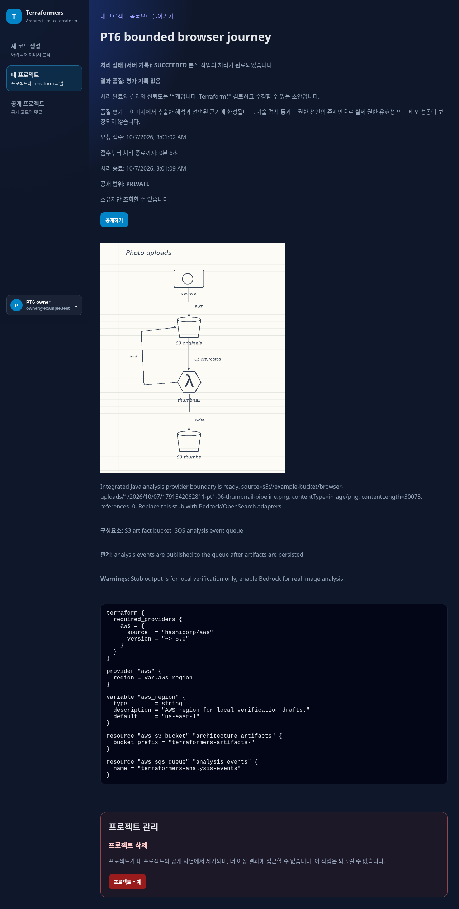
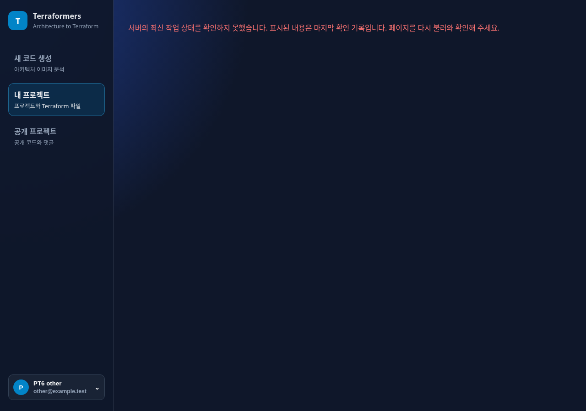
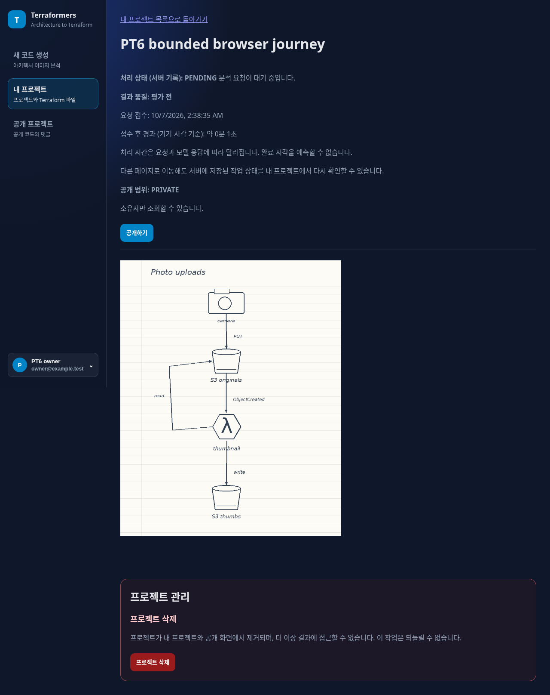

# PT-6 — one USER-authorized corrective browser journey

**HUMAN_REQUIRED: independent review and explicit merge. Current browser criteria PASS;
PT-6 is not independently accepted or COMPLETE.**

USER approved additional bounded corrective iteration **1** under
[review 6029913071](https://github.com/siamese-lang/terraformers-platform/pull/250#issuecomment-6029913071).
That review covered head `4ac4c3b339276cd181e07cf78f339692038aaf89` and did not itself grant
execution or merge authority. Same PR #250/branch and original base
`37e006be4d5995019704ea8a4009e1a59da039b2`; no rebase/rebind. Autonomous repairs remain **1**,
human-authorized corrective iterations **1**. This one execution is consumed; no second journey
is authorized. No PT-7, PT-2, live model/GCP, new IdP/IAM/CORS/security, retained teardown or merge.

## Narrow correction and tool integrity

The [corrective procedure](../evidence/product-trust-pt-6/correction-1/procedure.md) was frozen
before this outcome. Exact Dockerfile-pinned Terraform **1.8.5** and AWS provider **5.100.0** were
verified against existing archive SHA-256 values and extracted executable bytes under
`/workspace/.cloud-setup/pt6-terraform`. No system paths or Docker changed. [Prerequisite evidence](../evidence/product-trust-pt-6/correction-1/prerequisites.json)
records actual CLI/provider version selection, offline mirror init, valid schema acceptance and
invalid provider argument rejection. No plan/apply or cloud credentials.

Only the isolated test fixture constructs a primary **same real `TerraformCliValidator`** with
its existing **`ProcessCommandExecutor`**, default timeouts/cleanup and local binary/plugin paths.
Production validator/configuration, runner/provider, frontend, auth, prompts/model/RAG/truth and
workflows are unchanged. The driver verifies archive/executable checksums and CLI version before
startup/upload, passes fixture-local paths, binds the compiled fixture bytes and checks exact
HCL/job/file linkage. No pass-through/stub executable validator or application API mock.

The existing production JAR and fixture-configured frontend build bytes were reused unchanged,
verified against the initial recorded hashes. Updated test fixture was compiled by the focused
existing tests. Actual Chromium 151.0.7922.173 frontend still uses its original Cognito adapter;
only external Cognito transport is fulfilled with short-lived signed fixture tokens. All application
requests traverse real HTTP, backend JWT/ownership services, H2 and filesystem storage.

## One distinct post-change journey

[Raw result, 66 application responses and same-job stage logs](../evidence/product-trust-pt-6/correction-1/browser/result.json)
record **one** accepted upload/job `345d4807-bf84-4b81-9a8e-4144339abc50`. It is a fresh local
H2/filesystem session, not recovery or resubmission of failed job
`604890dc-c272-485c-b9d5-95fdede77504`. Numeric project/source IDs restart at 1 in the separate
local database; the job UUID and execution evidence identify the distinct submission.

| Original criterion | Observed result |
| --- | --- |
| Actual frontend login / real backend JWT | PASS; UI profile 204, owner list 200, backend JWKS fetch 1 |
| Anonymous / forged-signature controls | PASS; protected list 401 for each |
| Realistic binary upload once | PASS; 201, source ETag/roundtrip SHA matches the frozen input |
| Navigation/reload durable progress | PASS; same PENDING job/source/acceptedAt and elapsed anchor, no new submission |
| Original new job terminal | SUCCEEDED; real Terraform executable validation passed; provider stub-integrated-java |
| Trust/draft/timing UI | PASS; processing complete, quality **평가 기록 없음**, explicit editable draft/conditional limits, matching server timestamps |
| Same-job Terraform artifact | PASS; API latest job/file IDs match terminal result; displayed HCL text exactly equals artifact |
| Other identity private reads | PASS; actual frontend detail 403 and no image/HCL, plus metadata/tree/image/HCL/job probes 403 |
| Other identity mutations | PASS; visibility/Terraform/new-job/delete all 403, owner job/project/HCL/source/inventory unchanged |
| Anonymous private controls | PASS; metadata 403, job 401 |

AcceptedAt `2026-10-07T03:01:02.897549Z`; terminalAt `2026-10-07T03:01:09.540236Z`;
accepted-to-terminal **6642 ms**, including the controlled pre-claim hold. Actual stage telemetry:
analysis execution **4984 ms**, result finalize **36 ms**. These are local stub/CLI fixture timings,
not production/model latency. The stub returns no quality snapshot; absent quality is explicitly
shown instead of technical/semantic trust. No AI image interpretation, retrieval fidelity,
realistic generalization, effective deployed IAM or hosted IdP/password guarantee is established.

## Validation, preservation and gate

- Existing `TerraformCliValidatorTest` + `AnalysisJobOrchestratorTest`: **19 PASS**, 0 failures,
  errors or skips; offline test compile included the isolated fixture.
- Real pinned-tool offline preflight: CLI/provider versions and checksums PASS; valid HCL PASS;
  intentionally unsupported provider argument rejected. It is separate prerequisite validation.
- Browser runner exit **0**, all **5** declared steps PASS, one new upload only, no automatic
  retry/resubmission. Signing material/browser processes/local objects/database cleaned up.
- Python syntax, scope/durable-state/frozen identity/evidence audit and diff checks: recorded in
  [new validation evidence](../evidence/product-trust-pt-6/correction-1/validation.json).
  Existing frontend build/JAR and shared JWKS helper were unchanged; no unrelated suite repeat.
- All **21** preexisting evidence files and original frozen protocol remain byte-identical to the
  reviewed head, checked by [preservation inventory](../evidence/product-trust-pt-6/correction-1/preserved-evidence-inventory.json).
  The old failed job and its **1582 ms** fixture time remain FAILED evidence. No earlier outcome
  is replaced or reclassified. Original first-user concurrency/evidence-loss limitations remain.
- Reusable environment install/start instructions gained only a tested optional local pinned-tool
  block and bounded runner reference. Default minimal backend setup stays intact; the consumed
  authority does not permit a further browser execution. Saved configuration is not publication.

PT-2 final INCOMPLETE, NOT_RUN cases 03–10, 424846 ms original case-02 censor, zero-product
continuation/recovery failures, frozen truth/identity and earlier phase state remain unchanged.
Model calls/live cloud actions are **0**. GitHub owns transient PR lifecycle; durable active PR,
branch and URL fields stay null. Independent review of the corrected head and explicit merge
remain required; CI green alone is not acceptance. No PT-7 execution.

---

The following initial-head checkpoint is retained verbatim as historical failed evidence context.
It was independently reviewed by comment 6029913071 and superseded only by the distinct authorized
correction above; its original evidence directories are unchanged.

# PT-6 — partial real-browser journey; blocked

**HUMAN_REQUIRED: BOUNDED_REPAIR_LIMIT_AND_BROWSER_MEASUREMENT_BLOCKER. PT-6 is INCOMPLETE.**
Execution base `37e006be4d5995019704ea8a4009e1a59da039b2` remains bound once in the
[Work Package](../../.agents/work-packages/product-trust-pt-6-browser-journey-v1.yml).
The [procedure](product-trust-pt-6-browser-protocol.md) was frozen before outcomes.
No production code, prompt/model/RAG, truth, IAM, CORS, infrastructure, workflow or live cloud changed.

## Authority and implementation

PR #249's [review 6029459989](https://github.com/siamese-lang/terraformers-platform/pull/249#issuecomment-6029459989)
accepted PT-5 head `bc13af0cb889b803a8d83352ef869896c97348f8`; USER merged it at
`2026-10-07T02:16:09Z` as this base. PT-5 completion is recorded inside this substantive PT-6 PR,
with its original base and evidence preserved. Review alone does not authorize progression or merge.

The actual CRA production frontend executes its login form and existing Cognito Amplify adapter
in Chromium `151.0.7922.173`. Only external InitiateAuth/GetUser transport is fulfilled using
short-lived RS256 tokens from the existing shared OpenSSL/JWKS construction. Every application
API crosses HTTP to the unchanged packaged backend, real JWT decoder, H2 persistence, filesystem
storage and stub analysis. A loopback same-origin proxy preserves Host/Origin and Authorization;
it injects no identity and changes no CORS policy. No application API or React module is mocked.

An isolated test-source executor holds before the existing runner's claim, then releases via a
local filesystem marker. The existing executor configuration and runner remain in use. No fake
status/quality, new control endpoint, pass-through Terraform validator, permanent IdP or CI gate
is added. Only this fixture's compiled class is loaded; other test controllers/configurations are
excluded. It is absent from the packaged production jar. Local keys/tokens/browser processes,
objects and H2 state were removed; the retained GCP runtime was untouched.

## Direct browser evidence

[Raw result](../evidence/product-trust-pt-6/03-browser-partial/result.json) records one accepted
job `604890dc-c272-485c-b9d5-95fdede77504`, project/source `1/1`, 20 real API responses and
the exact frontend/JAR/input/source hashes. [Observed runner bytes](../evidence/product-trust-pt-6/runner-at-observation.txt)
match its recorded source SHA. The current runner additionally fails before startup/upload when
the known Terraform prerequisites are missing and serializes JWKS counts on failures; those changes
were syntax checked and the prerequisite refusal was checked without opening a browser or uploading.

| Declared step | Observed outcome | Evidence/limit |
| --- | --- | --- |
| Real login and authorization | PASS | UI profile write 204, owner list 200; anonymous/forged-signature list 401; actual JWKS fetch assertion passed, but its count was not serialized before terminal failure |
| One realistic upload | PASS | POST `/api/upload` 201, binary persisted, source ETag equals frozen input SHA, job PENDING |
| Navigate/reload durable progress | PASS | Same job/source and acceptedAt across owned list/detail/reload; live elapsed label anchored to server time; no second upload/job creation |
| Terminal draft/trust/result | NOT COMPLETED | Original job FAILED with technical FAIL, quality UNKNOWN, TERRAFORM_EXECUTABLE_FAILURE; no result artifact |
| Second identity denial | NOT_RUN | Stopped at preceding failure; PT-5 deterministic evidence is preserved but does not substitute for browser acceptance |

AcceptedAt `2026-10-07T02:38:35.115933Z`; terminalAt `2026-10-07T02:38:36.698294Z`;
accepted-to-failed-terminal **1582 ms**, including the controlled hold. This is local fixture time,
not model/provider or production latency. The browser's pending image loads are real filesystem
reads; terminal source-byte roundtrip comparison and HCL rendering were not reached.

## Preserved unsuccessful observations and correction boundary

All executions remain individually inspectable; none is replaced by a passing outcome:

| Evidence directory | Result | Submissions |
| --- | --- | --- |
| [00-startup-portability-failure](../evidence/product-trust-pt-6/00-startup-portability-failure/result.json) | Shared key bootstrap required unavailable `xxd`; use existing Python stdlib byte conversion instead | No browser/API/upload |
| [01-login-probe-failure](../evidence/product-trust-pt-6/01-login-probe-failure/result.json) | Concurrent first-user persistence collided on existing unique identity; driver cleanup then masked its assertion and lost in-memory events | No recorded upload; read-only recovery owner inventory empty |
| [02-profile-contract-failure](../evidence/product-trust-pt-6/02-profile-contract-failure/result.json) | Real profile write returned the existing correct 204; driver incorrectly expected 200 | One profile write; no upload |
| [03-browser-partial](../evidence/product-trust-pt-6/03-browser-partial/result.json) | Auth/upload/pending navigation passed; original job terminal FAILED | Exactly one upload, no resubmission |
| [04-known-prerequisite-refusal](../evidence/product-trust-pt-6/04-known-prerequisite-refusal/result.json) | Expected fail-closed preflight after the observed missing-tool failure | No server/browser/API/upload |

One bounded **measurement-driver** corrective iteration covered sequencing supplemental controls
after the actual first UI profile write, the correct 204 contract and cleanup lifetime. The local
bootstrap portability fix is recorded separately. No natural product/model case was rerun for PASS.
The first-user creation collision remains a supported local concurrency observation, not a repaired
product defect or a proven hosted/production failure. Serializing supplemental driver probes does not
prove concurrent first-user safety. The lost events/original assertion of execution 01 cannot be
reconstructed; only its surviving backend errors, cleanup traceback and read-only empty inventory
are claimed. Cleanup was completed manually for that orphaned local process; private material was removed.

## Blocker and proportional validation

Build/helper/backend failure logs are gzip archives of their exact original bytes, with
[uncompressed SHA bindings](../evidence/product-trust-pt-6/raw-log-bindings.json). Compression
avoids changing raw log whitespace while keeping the patch whitespace-clean.

`TerraformCliValidator` uses `/usr/local/bin/terraform` and `/opt/terraform-plugins` even for the
stub path. Both are absent in this minimal backend compile/test environment. Backend `Dockerfile`
pins Terraform **1.8.5** and AWS provider **5.100.0** with SHA-256 checks. The absolute locations
are outside the writable roots and owned by another OS user. The runner passed compilation but
failed runtime validation with `terraform_internal`; this is a **local measurement prerequisite
failure**, not evidence of invalid generated HCL or a new production Terraform defect.

No pass-through validator, production path/config change, Docker stack or live dependency is used
to make the journey pass. A bounded follow-up would need reviewed local installation/path handling
for those exact real validator prerequisites and explicit authority beyond the spent correction
boundary before another complete journey. This PR does not execute or authorize that follow-up.
It must not be accepted as completed PT-6 or used to start PT-7.

The concrete proposed correction is to download the existing Dockerfile-pinned CLI/provider into
the writable local tool cache and let only the isolated test fixture construct the **same real**
`TerraformCliValidator` with those local paths and its existing `ProcessCommandExecutor`. Do not
change the production validator or replace validation with a stub. Preserve this FAILED job and
authorize at most one distinct post-change browser regression, separately from the spent autonomous
counter. This proposal is not implemented and needs independent review plus explicit bounded
corrective-iteration authority; no model/GCP/IdP/CORS/security expansion is requested.

- Offline backend `mvn -o -DskipTests package`: PASS; compiles production and isolated fixture
  sources, packages unchanged product; tests intentionally skipped. No new backend product change
  requires repeating PT-5's independently accepted full suite (552 tests, 2 external MariaDB skips).
- Existing shared JWKS helper regressions: **7 tests PASS**, no failures/errors. Protected
  prepare/restore identity and cleanup guards remain intact; no protected runtime was accessed.
- Existing frontend production build with nonsecret fixture Cognito configuration: PASS. No
  production frontend source or dependency/lock change. Chromium/Playwright were preinstalled.
- Bash/Python syntax, frozen 26-file identity, scope/durable-state/evidence audit and diff check:
  see [validation](../evidence/product-trust-pt-6/validation.json). These do not turn the incomplete
  journey into PASS. No new workflow/CI gate or broad E2E suite.

Frozen realistic revision 3/identity `04f65a5c2c82a5afcab9ffe567018d0190b95877adb7c87a22797f0193e5c014`
is unchanged. Its pt1-06 bytes are a local upload fixture, **not** an AI observation or PT-2 sample.
PT-2 remains final INCOMPLETE: cases 03–10 NOT_RUN, no fabricated aggregate rates, case 02 censored
at **424846 ms**, and both continuation/recovery runs zero-product-observation failures. No PT-2
dispatch/rerun/exception is authorized. Model calls and live cloud actions here are **0**.

Independent review and a human-authorized bounded correction are required. CI green or this PR's
creation is not PT-6 acceptance, merge permission, PT-7 authority or Product Trust final closure.
